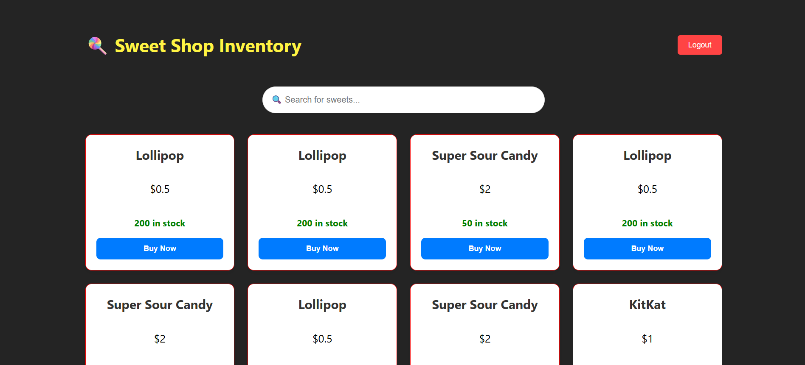

# Sweet Shop Management System 🍬

A full-stack inventory management application built to demonstrate **Test-Driven Development (TDD)**, secure authentication, and modern web development practices. This project was developed as a technical kata with transparent AI co-authorship.

## 📖 Project Overview
This application allows users to browse sweets, search by name or category, and purchase items (decrementing stock in real-time). Administrators can restock items, update details, and delete obsolete inventory.

### Key Features
* **Secure Authentication:** JWT (JSON Web Token) based login and registration.
* **Inventory Management:** CRUD operations (Create, Read, Update, Delete) for sweets.
* **Stock Control:** Logic to prevent purchasing out-of-stock items.
* **Search & Filter:** Real-time filtering by sweet name and category.
* **Responsive UI:** A modern dashboard built with React and CSS Grid.

---

## ⚙️ Tech Stack

### **Backend (The Brain)**
* **Language:** Python 3.10+
* **Framework:** FastAPI (High performance, easy validation)
* **Database:** SQLite (Relational DB with SQLAlchemy ORM)
* **Testing:** Pytest (Strict TDD workflow)
* **Security:** Passlib (Bcrypt hashing) & Python-Jose (JWT)

### **Frontend (The Face)**
* **Framework:** React 18 (via Vite)
* **HTTP Client:** Axios
* **Routing:** React Router DOM
* **Styling:** CSS Modules, Flexbox, & Grid

---

## 🚀 Setup & Installation

Follow these steps to get the project running locally.

### 1. Clone the Repository
```bash
git clone [https://github.com/AbuHurer/sweet-shop.git](https://github.com/AbuHurer/sweet-shop.git)
cd sweet-shop
````

### 2\. Backend Setup

The backend runs on port `8000`.

```bash
cd backend

# Create virtual environment
python -m venv venv

# Activate environment
# Windows:
venv\Scripts\activate
# Mac/Linux:
source venv/bin/activate

# Install dependencies
pip install -r requirements.txt

# Run the server
uvicorn main:app --reload
```

### 3\. Frontend Setup

Open a **new** terminal window. The frontend runs on port `5173`.

```bash
cd frontend

# Install Node dependencies
npm install

# Start the development server
npm run dev
```

Open your browser and navigate to: **`http://localhost:5173`**

-----

## 🧪 Test Report (TDD)

This project strictly followed the **Red-Green-Refactor** TDD cycle. You can verify the robustness of the backend by running the test suite.

**To Run Tests:**

```bash
cd backend
# Ensure your venv is active
python -m pytest
```

**Final Test Results:**
The test suite covers Authentication, Authorization, Inventory Management, and Business Logic (Stock validation).

```text
tests/test_auth.py ..                                       [ 25%]
tests/test_login.py .                                       [ 37%]
tests/test_sweets.py .....                                  [100%]

========================= 8 passed in 1.25s ==========================
```

-----

## 🤖 My AI Usage

In compliance with the assessment policy, I have used AI tools transparently as a pair programmer and co-author.

**AI Tool Used:** Gemini 1.5 Pro

**Usage Log:**

  * **Project Scaffolding:** I used Gemini to generate the initial directory structure and boilerplate code for FastAPI and Vite, allowing me to jump straight into logic.
  * **TDD Implementation:** I utilized AI to draft "Red" (failing) unit tests based on the requirements (e.g., "Write a test that fails if a user buys a sweet with 0 quantity"). This ensured I adhered to the Red-Green-Refactor pattern.
  * **Debugging:** When I encountered a `ResponseValidationError` due to a mismatch between my Pydantic V2 schemas and the SQLite database state, I used Gemini to diagnose the issue (Schema vs DB migration) and generate the fix.
  * **Frontend Styling:** I prompted the AI to generate clean CSS Grid and Flexbox layouts to center the login form and dashboard, ensuring a professional look without using heavy UI libraries.

**Reflection:**
AI acted as an accelerator for syntax and boilerplate, but the architectural decisions and TDD discipline remained my responsibility. The requirement to co-author commits forced me to be mindful of exactly *what* code was being generated vs. what I understood. It turned the development process into a review-and-refine workflow rather than just typing from scratch.

-----

## 📸 Screenshots

### Login Screen


### Inventory Dashboard



-----

## 📝 API Endpoints Reference

| Method | Endpoint | Description | Auth Required |
| :--- | :--- | :--- | :--- |
| `POST` | `/api/auth/register` | Register new user | ❌ |
| `POST` | `/api/auth/login` | Login & receive JWT | ❌ |
| `GET` | `/api/sweets` | List all sweets | ✅ |
| `POST` | `/api/sweets` | Add new sweet | ✅ |
| `PUT` | `/api/sweets/{id}` | Update sweet details | ✅ |
| `DELETE` | `/api/sweets/{id}` | Delete a sweet | ✅ |
| `POST` | `/api/sweets/{id}/purchase` | Buy sweet (stock -1) | ✅ |
| `GET` | `/api/sweets/search` | Search by name/category | ✅ |
